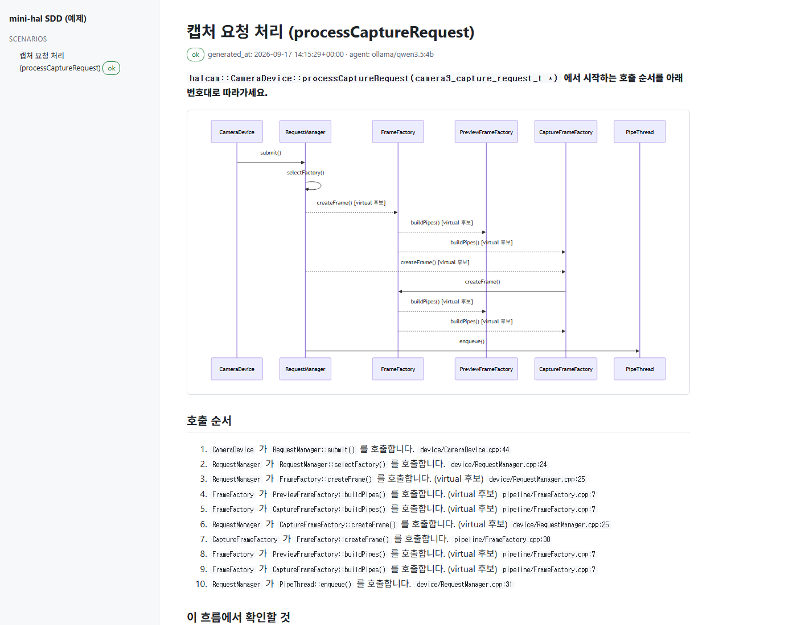
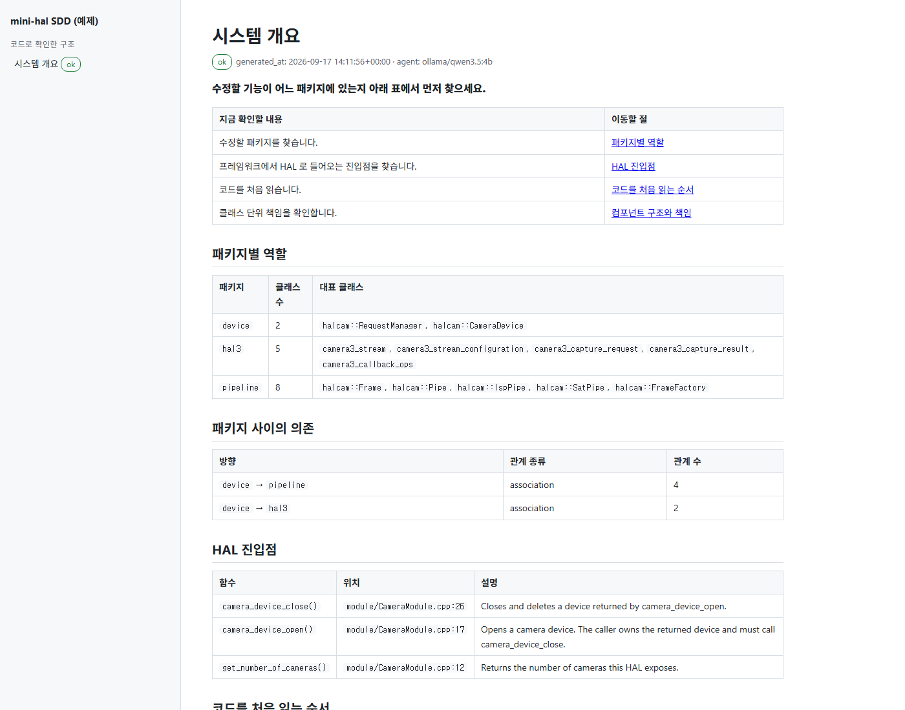
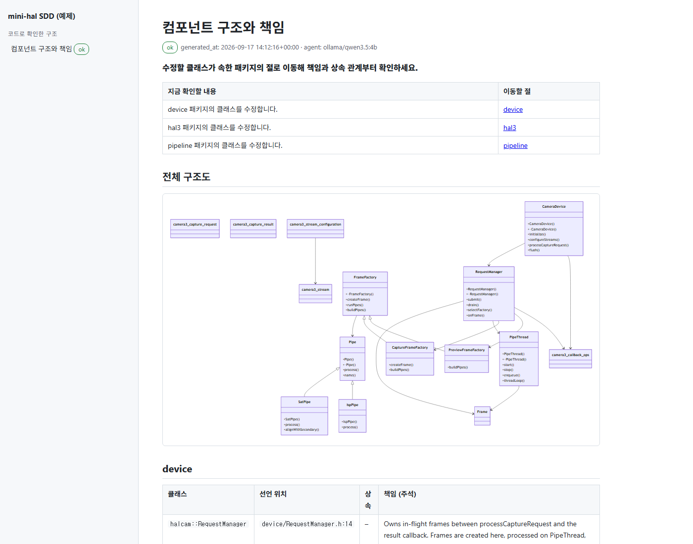

# camera-hal-sdd

사내 Camera HAL(C++)의 SDD(Software Design Document)를 자동으로 생성하고, Gerrit 변경이 들어올 때 영향을 받는 섹션만 다시 쓰는 파이프라인입니다.

핵심 원칙은 하나입니다. **C++ 구조는 Clang이 읽고, LLM은 서술만 합니다.** LLM은 사실(facts) 블록에 있는 내용만 쓸 수 있고, 모든 문장에 `파일:줄` 인용을 붙여야 하며, 인용이 사실에 없으면 문서는 `needs-review` 상태로 사람에게 넘어갑니다.

## 무엇이 나오는가

아래는 `examples/mini-hal/`(작은 C++ HAL 예제)을 사내형 소형 모델 `qwen3.5:4b`(Ollama)로 실제 실행해 얻은 페이지입니다. 표, 번호 목록, 다이어그램은 모두 libclang 이 읽은 사실에서 파이프라인이 직접 만든 것이고, LLM 은 그 아래 문단만 썼습니다.

**시나리오 페이지.** 진입 함수에서 시작하는 호출 순서를 시퀀스 다이어그램과 번호 목록으로 보여 줍니다. 가상 함수 호출은 "virtual 후보"(점선)로, 함수 포인터 호출은 "정적 추적 불가"로 표시되어 정적 분석이 어디서 끊기는지 독자가 바로 압니다. 각 단계 끝의 `파일:줄`이 근거입니다.



**시스템 개요 페이지.** 첫 줄은 독자가 먼저 할 일이고, 그다음 표가 "지금 확인할 내용 → 이동할 절"입니다. 패키지 표, 패키지 의존 표, HAL 진입점 표, 코드를 처음 읽는 순서까지 사실에서 나옵니다. 왼쪽 목차의 `ok` 배지는 인용 검증을 통과했다는 뜻입니다.



**컴포넌트 페이지.** 클래스 다이어그램과 패키지별 클래스 표(선언 위치, 상속, 소스 주석)를 먼저 놓고, 패키지마다 LLM 이 소유·의존 관계를 서술합니다. 절마다 접힌 "근거와 검토 정보"에 근거 파일, 인용 검증 결과, 검토 상태가 남습니다.



스크린샷은 `sdd export-html --pages <페이지>` 로 만든 단일 HTML 을 찍은 것입니다. 전체 결과는 [examples/mini-hal/expected-output/](examples/mini-hal/expected-output/) 에 Markdown 과 단일 HTML(`sdd.html`)로 있습니다.

```
Gerrit change (또는 nightly)
   │  git diff → 변경 파일 / 클래스 / 시나리오
   ▼
compile_commands.json   ← ndk-build compile_commands.json (NDK 구성 기준 -I / -D)
   │
   ▼
사실 추출 (결정적, LLM 없음)                      src/sdd/facts/
   ├ clang-uml : class / package / include / sequence → JSON + Mermaid
   ├ libclang  : 선언·정의 위치, 주석(-fparse-all-comments), 자유 함수
   └ flags     : compile DB 의 -D 와 소스의 #if 분기 위치
   │
   ▼
build/facts/facts.json (canonical knowledge model, 모든 항목에 file:line)
   │
   ▼
영향 매핑 (impact.py) : 변경 파일 → 재생성할 섹션 / 시나리오
   │
   ▼
LLM (사내 Ollama 의 Qwen / Hermes, 또는 openai-compatible 게이트웨이)
   섹션마다 따로 호출, 입력 예산 초과분은 우선순위 낮은 사실부터 통째로 제외
   │
   ▼
인용 검증 (validate.py) + 문장 린트 (manuscript.py) → sdd/*.md (+ frontmatter: status, facts_omitted)
   │
   ▼
docs 저장소 Gerrit change → 사람 리뷰 → merge → mkdocs 게시
```

## 준비물

| 항목 | 이유 |
|---|---|
| Python 3.11+ 와 [uv](https://docs.astral.sh/uv/) | 파이프라인 실행. `uv sync` 가 Python 도 받아 줍니다. |
| NDK r25 이상, `ndk-build` 가 PATH 에 있음 | `ndk-build compile_commands.json` 으로 compile DB 생성. r25 미만은 인자 escaping 이 불안정합니다. |
| [clang-uml](https://github.com/bkryza/clang-uml) (권장) | 클래스/패키지/시퀀스 다이어그램과 JSON 모델. PATH 에 없으면 libclang 대체 경로(`facts/callgraph.py`)가 호출 순서와 상속·필드 관계를 뽑습니다. 대체 경로는 템플릿 관계, 조건 분기 블록, include 그래프를 만들지 못합니다. |
| Ollama 또는 openai-compatible 사내 LLM 엔드포인트 | 코드가 사내 밖으로 나가지 않아야 하므로 외부 SaaS 는 지원하지 않습니다. |

libclang 은 pip 패키지(`libclang`)가 공유 라이브러리를 함께 설치하므로 별도 LLVM 설치가 필요 없습니다.

## 예제로 먼저 보기

`examples/mini-hal/` 은 CameraDevice → RequestManager → FrameFactory → Pipe 구조를 흉내 낸 작은 C++ HAL 입니다. NDK 도 clang-uml 도 없는 머신에서 결과물을 확인할 수 있게, compile DB 는 Android.mk 의 플래그를 옮긴 `simple_compdb` 로 만들고 구조 추출은 libclang 대체 경로를 씁니다.

```bash
uv sync --extra dev
uv run sdd --config examples/mini-hal/sdd.yaml run     # extract + generate (Ollama 의 qwen3.5:4b 사용)
```

결과는 `examples/mini-hal/sdd/` 에 생깁니다. LLM 없이 뼈대만 보려면 `examples/mini-hal/sdd.yaml` 의 `agent.kind` 를 `dry-run` 으로 바꾸세요.

## 빠른 시작

사내 도입 전에 공개 libcamera 소스로 검증하려면 [libcamera 가정용 검증 환경](docs/libcamera-home-lab.md)을 따르세요. Ubuntu/Meson 준비, 실행용 설정, 커밋별 갱신 설계와 현재 구현의 한계를 정리했습니다.

[실제 WSL2 실행 기록](docs/libcamera-wsl-run.md)과 [공개 검토용 문서](https://ttolsun.github.io/libcamera-sdd/)도 확인할 수 있습니다. 전용 저장소는 [TTolsun/libcamera-sdd](https://github.com/TTolsun/libcamera-sdd)이며, 원본 이력과 문서를 별도 브랜치로 관리합니다.

`sdd export-site`는 libcamera 공식 문서와 OMM의 읽기 중심 디자인을 참고한 정적 사이트를 만듭니다. 좌측 탐색 메뉴, 우측 목차, 제목 검색과 Mermaid 확대·요소 검색을 제공합니다. [사이트 구성과 사내 배포 설정](docs/document-site.md)을 확인하세요. 생성·디자인 기술은 이 저장소에 두고 `libcamera-sdd`에는 산출물만 배포합니다.

Mermaid는 공통 생성 규칙으로 Markdown을 만들 때마다 갱신합니다. `site.enabled: true`이면 `generate`와 `run`이 사이트 빌드까지 수행합니다. 빌드는 내부 링크를 검사하고 입력·출력 해시를 기록하며, 직전 빌드에서 관리한 오래된 파일만 정리합니다. `sdd verify-site`로 결과를 다시 검사할 수 있습니다. 유지보수 시 [디자인 계약](DESIGN.md)과 회귀 테스트를 함께 갱신하세요.

[두 실제 libcamera 커밋의 비교 검증](docs/libcamera-revision-validation.md)에서는 구조 추출과 Mermaid 변경을 확인했습니다. 문서 범위 누락과 LLM의 관계 설명 오류도 발견했으므로, 현재 결과는 무인 게시 승인 기준을 충족하지 않습니다.

```bash
uv sync --extra dev
uv run sdd doctor            # 도구, compile DB, LLM 도달 여부 점검
```

```bash
uv run sdd compdb            # ndk-build 로 compile_commands.json 생성 (이미 있으면 건너뜀)
uv run sdd extract           # clang-uml + libclang + flags → build/facts/facts.json
uv run sdd generate          # 전체 섹션 생성 → sdd/*.md
```

변경분만 다시 쓰려면:

```bash
uv run sdd run --base origin/main     # extract → impact → 영향 섹션만 generate
```

파일 하나짜리 HTML 이 필요하면(메일 첨부, 리뷰 코멘트, 오프라인 열람):

```bash
uv run sdd export-html --out build/sdd.html          # 전체
uv run sdd export-html --pages scenarios/flush.md    # 한 페이지만
```

LLM 없이 파이프라인만 점검하려면 `sdd.local.yaml` 에 `agent: {kind: dry-run}` 을 두면 됩니다. 프롬프트가 `build/prompts/` 에 기록됩니다.

## 설정

| 파일 | 내용 |
|---|---|
| `sdd.yaml` | 소스 경로, compile DB, 출력 위치, LLM(agent), 검증 정책. 로컬 덮어쓰기는 `sdd.local.yaml` (git 제외). |
| `config/sections.yaml` | SDD 섹션 정의. 섹션마다 사실 출처(`facts`)와 영향 감시 경로(`watch`)를 고정합니다. |
| `config/scenarios.yaml` | 시퀀스 다이어그램 진입점. 이 목록이 "핵심 시나리오" 목차와 1:1 입니다. 실제 HAL 시그니처로 교체해야 합니다. |
| `config/clang-uml.yaml` | 정적 다이어그램 설정. NDK sysroot 문제는 `remove_compile_flags` / `add_compile_flags` 로 조정합니다. |
| `prompts/*.md` | system 규칙, 섹션 템플릿, 변경 요약 템플릿. |
| `style/` | 집필 규칙. `README.md` 는 항상 system 프롬프트에 들어가고, 원문 두 개는 `agent.full_style_guides: true` 일 때만 들어갑니다. |
| `templates/page.md` | 페이지 뼈대. 절 구조를 바꾸려면 여기만 고칩니다. |

`agent` 설정은 omm-doc-workflow 의 `agent.kind / agent.model / agent.baseUrl` 과 같은 의미입니다.

```yaml
agent:
  kind: ollama                 # ollama | openai-compatible | dry-run
  model: qwen3.5:4b            # 또는 hermes 계열
  base_url: http://localhost:11434
  max_input_chars: 18000       # 소형 모델 기준. 초과분은 사실 블록 단위로 제외되고 frontmatter 에 기록됩니다.
```

API 토큰이 필요한 게이트웨이는 환경 변수 `SDD_AGENT_API_KEY` 로 넘깁니다. 설정 파일에는 두지 않습니다.

## 생성되는 SDD

문서 형식은 omm-doc-workflow 와 같은 집필 규칙(`style/README.md`: i-have-adhd + fluent-korean 의 개발자 문서 번안)을 따릅니다. 모든 페이지가 같은 뼈대를 씁니다.

1. **할 일 또는 결론 한 문장** (굵게)
2. **지금 확인할 내용 → 이동할 절** 표
3. 본문: 표와 번호 목록은 사실에서 파이프라인이 직접 만들고, LLM 은 표만으로 알 수 없는 관계를 서술하는 문단만 씁니다. 문장마다 `파일:줄` 인용이 붙습니다.
4. **근거와 검토 정보** (접힘): 근거 파일, 근거 수준, 인용 검증 결과, 제외된 사실, 검토 상태
5. **다음 단계** 문서 하나

| 페이지 | 파이프라인이 만드는 것 | LLM 이 쓰는 것 |
|---|---|---|
| 시스템 개요 | 패키지 표, 패키지 의존 표, HAL 진입점 표, 코드를 처음 읽는 순서 | 패키지 사이의 관계 설명 |
| 컴포넌트 구조와 책임 | 클래스 다이어그램, 패키지별 클래스 표(선언 위치, 상속, 주석) | 패키지마다 소유·의존 관계 설명 |
| 핵심 시나리오 | 시퀀스 다이어그램, 번호 붙인 호출 순서 | 이 흐름에서 확인할 것 |
| Feature flag 매트릭스 | `-D` 플래그와 `#if` 위치 표 | 없음 |
| 스레드와 큐 모델 | 스레드 관련 클래스 표 | 서술 (`needs_human` 고정) |
| 변경 시 지켜야 할 제약, 설계 결정 기록 | 없음 (사람이 씀). 근거 파일이 바뀌면 재검토로 표시 | 없음 |

"코드로 확인한 구조" 와 "사람이 기록한 설계" 를 사이트 내비게이션에서 나눕니다. 각 문서의 frontmatter 에 `source_commit`, `agent`, `status`(ok / needs-review), `facts_omitted` 가 남습니다. 리뷰어는 `needs-review` 와 `facts_omitted` 가 있는 문서부터 봅니다.

## 알려진 한계

- compile DB 는 NDK 구성 하나만 반영합니다. AOSP 빌드에서만 켜지는 `-D` 분기는 문서에서 빠집니다. 필요하면 `SOONG_GEN_COMPDB=1 m nothing` 으로 만든 두 번째 compile DB 를 `sdd.local.yaml` 로 지정해 따로 돌립니다.
- 가상 함수, 함수 포인터, factory 패턴은 정적 시퀀스에서 끊깁니다. 끊긴 지점은 시나리오 문서에 "확인 필요" 로 남습니다.
- 스레드 소유와 타이밍은 정적 분석으로 나오지 않습니다. 스레드 섹션은 항상 사람이 보완합니다.

## 저장소 구조

```
sdd.yaml                 파이프라인 설정
config/                  섹션, 시나리오, clang-uml 설정
prompts/                 LLM 프롬프트
style/                   집필 규칙 (omm-doc-workflow 와 동일, MIT)
templates/page.md        페이지 뼈대
src/sdd/                 파이프라인 코드 (cli, compdb, extract, impact, generate, llm, validate, manuscript, budget)
src/sdd/facts/           사실 추출 (model, clang_uml, callgraph(libclang 대체), comments, flags)
examples/mini-hal/       작은 C++ HAL 예제 + 파싱 전용 std 스텁
sdd/                     생성된 SDD (mkdocs docs_dir). 리뷰 대상.
ci/                      Gerrit 훅 예시
docs/pipeline-design.md  이 파이프라인 자체의 설계 문서
tests/                   pytest (libclang 실제 파싱 포함)
```

## 예제 실행 결과

`examples/mini-hal/expected-output/` 은 이 저장소의 파이프라인을 로컬 Ollama `qwen3.5:4b` 로 실제로 돌려 얻은 결과 스냅샷입니다. 11개 LLM 절 중 11개가 인용 검증을 통과했고(재시도 2회), 표·번호 목록·다이어그램은 모두 libclang 사실에서 나온 것입니다. 소형 모델의 문장 품질과 파이프라인이 걸러 주는 것/걸러 주지 못하는 것을 판단하는 기준으로 쓰세요. 관찰 내용은 `docs/pipeline-design.md` 8-1 절에 있습니다.
