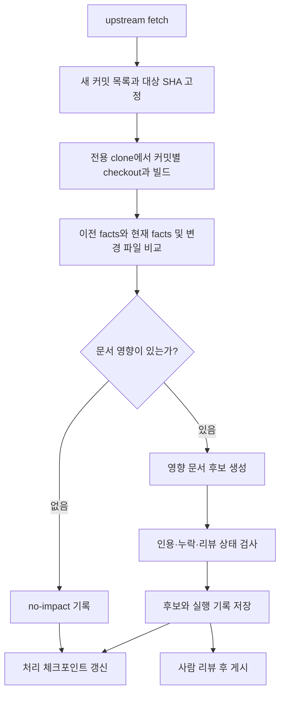

# libcamera를 이용한 가정용 문서 자동 갱신 검증 환경

**Ubuntu에서 libcamera의 한 커밋으로 문서를 먼저 생성하고, 두 커밋 사이의 변경이 관련 문서에 반영되는지 검증합니다.** 이 공개 검증 결과를 바탕으로 사내 Camera HAL과 Gerrit에 적용합니다.

실제 WSL2 빌드·생성과 GitHub Pages 공개 결과는 [실행 및 배포 기록](libcamera-wsl-run.md)에 있습니다.

| 지금 확인할 내용 | 이동할 절 |
|---|---|
| 테스트 범위와 현재 구현 수준을 확인합니다. | [목표와 범위](#1-목표와-범위) |
| 집에서 실행할 환경을 준비합니다. | [환경 구성](#2-환경-구성) |
| 최초 문서와 변경 문서를 생성합니다. | [수동 검증 절차](#3-수동-검증-절차) |
| 커밋마다 자동 처리할 구조를 확인합니다. | [자동 갱신 설계](#4-자동-갱신-설계) |
| 사내 도입 여부를 판단합니다. | [합격 기준과 사내 전환](#5-합격-기준과-사내-전환) |

## 1. 목표와 범위

### 검증 목표

공개 libcamera 소스로 코드 변경 감지, Clang 사실 추출, 문서 영향 분석, 로컬 LLM 서술, 인용 검증을 시험합니다. 실제 카메라가 없어도 정적 문서화 실험을 시작할 수 있습니다. 카메라 촬영과 GStreamer 재생은 별도의 실행 검증입니다.

처음에는 CameraManager·Camera·Request, Pipeline Handler, IPA 관련 클래스의 세 페이지를 생성합니다. 이후 GStreamer, 특정 하드웨어 파이프라인, 캡처 시나리오로 확장합니다. 빌드하지 않은 파이프라인까지 분석되었다고 간주하지 않습니다.

libcamera의 모든 설계 이유를 코드에서 복원하는 것이 목표는 아닙니다. 설계 의도는 공식 설계 문서나 사람이 기록한 결정과 연결하고, 코드에서 확인한 구조와 구분합니다.

### 현재 구현과 추가 개발의 경계

| 기능 | 현재 상태 | 가정용 검증 방법 |
|---|---|---|
| 기존 compile DB 입력 | 지원합니다. | Meson이 만든 파일을 지정합니다. |
| 클래스·위치·호출 관계 추출 | libclang 대체 경로를 지원합니다. | 파싱 오류와 추출 누락을 확인합니다. |
| 변경 파일 → 문서 영향 분석 | 경로 규칙과 현재 facts의 클래스·시나리오를 이용합니다. | `impact --base A --head B`를 실행합니다. |
| 영향받은 문서 생성 | 지원합니다. | `generate --from-impact`를 실행합니다. |
| 커밋 감시·큐·재시작 | 미구현입니다. | 수동 검증 후 별도 실행기를 구현합니다. |
| 이전/현재 심볼 비교·삭제 추적·근거 역색인 | 완전한 형태로 구현되지 않았습니다. | 이전 facts와 문서를 보관하고 사람이 대조합니다. |
| 리뷰 대기·문서 저장소 커밋·MR/PR·게시 | 이 예제에서는 자동화하지 않습니다. | 후보 산출물과 승인된 결과를 구분합니다. |

공유 대화에 나온 `NONE/LOW/MEDIUM/HIGH` 분류와 LLM의 의미 변화 판단도 현재 기능이 아닙니다. 초기에는 경로 규칙에 따른 대상 선택과 실제 문서 변경 여부부터 측정합니다. 테스트나 서식 변경이라는 이유만으로 모든 변경을 무조건 제외하지 않습니다.

### 공식 소스 주소

2026-09-20 조회에서 [기존 Getting Started](https://libcamera.org/getting-started.html)는 `git.libcamera.org`를, [master Getting Started](https://docs.libcamera.org/master/getting-started.html)는 `https://gitlab.freedesktop.org/camera/libcamera.git`을 안내했습니다. 이 문서는 master 문서의 GitLab 주소를 사용합니다. 공유 대화에서 언급된 이전 시점은 별도로 확인하지 않았습니다.

재현 기준은 주소뿐 아니라 **소스 SHA, 빌드 옵션, 문서 생성기 SHA, 모델 식별자**입니다. 움직이는 `master` 이름만 실행 기록에 남기지 않습니다.

## 2. 환경 구성

### 기본 구성

| 구성 요소 | 이 문서의 기본값 | 역할 |
|---|---|---|
| 실행 OS | Ubuntu 24.04 LTS를 실험 기준으로 가정합니다. | C++ 빌드와 사실 추출을 같은 Linux 환경에서 수행합니다. |
| Windows 호스트 | Ubuntu VM 또는 WSL2를 사용할 수 있습니다. | 편집과 결과 열람에 사용합니다. 실제 장치 접근은 별도 확인합니다. |
| 소스 | upstream libcamera의 전용 clone | 자동 checkout이 개인 작업에 영향을 주지 않게 합니다. |
| 빌드 | Meson + Ninja + C++ 툴체인 | 실제 구성의 compile DB와 생성 헤더를 준비합니다. |
| 문서 생성기 | 이 저장소 + Python 3.11 이상 + uv | 현재 의존성은 `uv.lock`으로 고정합니다. |
| LLM | 첫 실행은 `dry-run`, 다음은 로컬 Ollama | 설치된 모델과 입력 예산을 기록합니다. |
| 결과 | 로컬 Markdown과 HTML | 리뷰 후 승인된 결과를 별도로 보관합니다. |

GPU와 메모리 요구량은 선택한 모델과 컨텍스트에 따라 달라지므로 고정된 최소 사양을 제시하지 않습니다. 첫 실험에서 최대 메모리, 생성 시간, 입력 생략량을 측정합니다. 예제의 `qwen3.5:4b`는 기존 프로젝트 설정을 이어받은 값이며, libcamera에서 품질이 검증되었다는 뜻은 아닙니다.

Linux에서 다음과 같이 두 저장소를 나란히 둡니다. Windows의 가상환경이나 compile DB를 복사해서 Linux에서 재사용하지 않습니다.

```text
~/work/
├── camera-hal-sdd/
│   └── examples/libcamera/
│       ├── sdd.yaml
│       ├── config/
│       ├── prompts/
│       └── build/            # facts, 영향 보고, 문서, 실행 기록
└── libcamera/
    └── build/                # Meson 산출물과 compile_commands.json
```

### 준비 절차

아래 명령은 Ubuntu의 Bash에서 실행합니다. 패키지 목록은 공식 Getting Started를 바탕으로 C++ 빌드와 선택적인 GStreamer 분석에 필요한 항목을 구성했습니다. 대상 SHA에서 의존성이 달라지면 Meson 진단과 해당 checkout의 문서를 따릅니다.

1. 빌드 의존성을 설치합니다.

   ```bash
   sudo apt update
   sudo apt install git build-essential meson ninja-build pkg-config \
     python3 python3-yaml python3-ply python3-jinja2 \
     libyaml-dev libgnutls28-dev openssl libudev-dev \
     libgstreamer1.0-dev libgstreamer-plugins-base1.0-dev
   ```

2. `~/work/camera-hal-sdd`에 이 저장소를 준비한 뒤, libcamera를 받습니다.

   ```bash
   mkdir -p "$HOME/work"
   cd "$HOME/work"
   git clone https://gitlab.freedesktop.org/camera/libcamera.git
   ```

3. 이미 설치한 uv로 문서 생성기 의존성을 설치합니다. uv 설치가 필요하면 [공식 설치 안내](https://docs.astral.sh/uv/getting-started/installation/)를 사용합니다.

   ```bash
   cd "$HOME/work/camera-hal-sdd"
   uv sync --frozen --extra dev
   ```

4. libcamera를 구성하고 빌드합니다. 시스템 설치는 문서화 실험의 필수 단계가 아닙니다.

   ```bash
   cd "$HOME/work/libcamera"
   meson setup build
   ninja -C build
   test -s build/compile_commands.json
   meson configure build
   git rev-parse HEAD
   ```

Meson 설정만으로 멈추지 않고 빌드까지 수행하는 이유는 분석에 필요한 생성 헤더를 준비하기 위해서입니다. 실제로 활성화된 pipeline·IPA·GStreamer 구성은 `meson configure build`와 compile DB에서 확인합니다. 모든 하드웨어 구현이 기본 설정에 포함된다고 가정하지 않습니다.

## 3. 수동 검증 절차

### 3-1. 한 커밋으로 최초 생성

1. 전용 clone이 깨끗한지 확인하고 경로를 설정합니다.

   ```bash
   export SDD_ROOT="$HOME/work/camera-hal-sdd"
   export LIBCAMERA_ROOT="$HOME/work/libcamera"
   export SDD_CONFIG="$SDD_ROOT/examples/libcamera/sdd.yaml"
   export SDD_PYTHON="$SDD_ROOT/.venv/bin/python"
   git -C "$LIBCAMERA_ROOT" status --short
   ```

   경로가 다르면 예제 디렉터리의 `sdd.local.yaml`에서 `source.root`와 `source.compile_commands`를 함께 변경합니다. 상대 경로는 그 설정 파일이 있는 디렉터리 기준입니다.

2. pip libclang이 실제 Clang의 표준 헤더와 작업 디렉터리를 사용하도록 분석용 compile DB를 준비합니다. 원본 Meson 파일은 보존합니다.

   ```bash
   "$SDD_PYTHON" "$SDD_ROOT/examples/libcamera/prepare_compdb.py" \
     --build-dir "$LIBCAMERA_ROOT/build" \
     --out "$SDD_ROOT/examples/libcamera/build/compile_commands.json"
   ```

   `examples/libcamera/sdd.local.yaml`에 아래 설정을 추가합니다. 파일에 다른 설정이 있으면 유지합니다.

   ```yaml
   source:
     compile_commands: build/compile_commands.json
   ```

   이제 사실을 추출합니다.

   ```bash
   cd "$LIBCAMERA_ROOT/build"
   "$SDD_PYTHON" -m sdd.cli --config "$SDD_CONFIG" extract
   "$SDD_PYTHON" "$SDD_ROOT/examples/libcamera/verify_facts.py" --config "$SDD_CONFIG"
   ```

   현재 파서는 compile DB의 `directory`로 작업 디렉터리를 자동 변경하지 않습니다. 준비 스크립트는 include 경로를 절대 경로로 바꾸고, 각 명령에 `-working-directory`와 `-resource-dir`를 추가합니다. 파싱뿐 아니라 AST의 헤더 위치를 판별할 때도 올바른 경로가 필요하기 때문입니다. 이 절차로 `stddef.h` 누락과 핵심 헤더 제외 문제를 보완합니다. 이 스크립트는 Linux의 Clang 빌드를 대상으로 합니다. `--skip-clang-uml`은 libclang 호출 그래프도 생략하므로 사용하지 않습니다. 예제의 `tools.clang_uml: none`이 libclang 대체 경로를 선택합니다.

3. 앞 단계의 `verify_facts.py`가 성공하고 파싱 오류가 없는지 확인한 후 dry-run 문서를 생성합니다. 이 검사는 핵심 클래스의 존재, 페이지별 사실 선택, SHA 일치, 실제 파일의 인용 위치를 확인합니다. `facts-verification.json`의 `ok`가 false이면 LLM 생성으로 넘어가지 않습니다.

   ```bash
   "$SDD_PYTHON" -m sdd.cli --config "$SDD_CONFIG" generate
   "$SDD_PYTHON" -m sdd.cli --config "$SDD_CONFIG" export-html \
     --title "libcamera 설계 문서 검증" \
     --out "$SDD_ROOT/examples/libcamera/build/sdd.html"
   ```

   결과는 `examples/libcamera/build/facts/facts.json`, `build/prompts/`, `build/sdd/*.md`, `build/sdd.html`에 생깁니다. dry-run 결과는 문서 구조와 프롬프트 확인용입니다. LLM 서술 품질이나 인용 검증 합격으로 기록하지 않습니다.

4. 로컬 Ollama 모델이 준비되면 `examples/libcamera/sdd.local.yaml`의 기존 `source` 설정을 유지하면서 `agent` 설정을 추가합니다.

   ```yaml
   agent:
     kind: ollama
     model: qwen3.5:4b
     base_url: http://localhost:11434
   ```

   설치된 모델 이름에 맞춰 값을 변경하고 `generate`와 `export-html`을 다시 실행합니다. 주소는 **파이프라인을 실행하는 Linux에서 접속 가능한 주소**여야 합니다. Windows에서 Ollama를 실행한다면 `localhost`로 접근 가능한지 별도로 확인합니다. 위 설정 파일은 Git에서 제외됩니다.

### 3-2. 생성 직후 확인할 항목

| 확인 항목 | 판단 기준 |
|---|---|
| 소스 식별 | facts의 `meta.source_commit`이 분석한 checkout의 SHA와 같습니다. |
| 파싱 품질 | `[comments]` 오류를 확인하고 누락된 include·생성 헤더·컴파일러 옵션을 해결합니다. 오류가 있어도 facts가 저장될 수 있습니다. |
| 대상 클래스 | CameraManager·Camera·Request와 빌드에 포함된 PipelineHandler·IPA 클래스가 기대한 범위로 존재합니다. |
| 근거와 생략 | 문장의 인용을 실제 파일과 대조하고 `facts_omitted`를 확인합니다. 인용 검증 통과만으로 문장의 의미가 맞다고 판단하지 않습니다. |
| 리뷰 상태 | `needs-review`를 별도 검토합니다. CLI 종료 코드 0은 모든 문서의 승인 상태를 뜻하지 않습니다. |

현재 `doctor`는 NDK 도구와 clang-uml이 없어도 실패를 표시합니다. 이 예제는 두 도구를 사용하지 않으므로 `doctor`의 종료 코드만으로 실험을 판정하지 않습니다. 또한 facts의 `build_config`는 Meson 입력에도 `simple_compdb`라고 기록되므로 실제 빌드 방식은 별도 실행 기록에 남깁니다.

### 3-3. 두 커밋의 문서 비교

먼저 앞 절에서 검증한 소스 SHA를 A로 정하고, 그 상태의 facts·문서·빌드 옵션을 `build/runs/<A>/`처럼 별도 디렉터리에 보관합니다. B는 전용 clone에서 테스트할 실제 커밋 SHA로 지정합니다. 아래 변수의 설명 문자열을 실제 SHA로 바꾼 뒤 실행합니다.

1. B를 checkout하고 B의 빌드 산출물을 준비합니다.

   ```bash
   export BASE_SHA="A의 실제 커밋 SHA"
   export TARGET_SHA="B의 실제 커밋 SHA"
   git -C "$LIBCAMERA_ROOT" switch --detach "$TARGET_SHA"
   cd "$LIBCAMERA_ROOT"
   meson setup --reconfigure build
   ninja -C build
   ```

2. B에서 facts와 영향 보고를 만듭니다.

   ```bash
   cd "$LIBCAMERA_ROOT/build"
   "$SDD_PYTHON" "$SDD_ROOT/examples/libcamera/prepare_compdb.py" \
     --build-dir "$LIBCAMERA_ROOT/build" \
     --out "$SDD_ROOT/examples/libcamera/build/compile_commands.json"
   "$SDD_PYTHON" -m sdd.cli --config "$SDD_CONFIG" extract
   "$SDD_PYTHON" "$SDD_ROOT/examples/libcamera/verify_facts.py" --config "$SDD_CONFIG"
   "$SDD_PYTHON" -m sdd.cli --config "$SDD_CONFIG" impact \
     --base "$BASE_SHA" --head "$TARGET_SHA"
   ```

3. `examples/libcamera/build/impact.json`을 읽고, 영향 섹션이 있을 때만 갱신합니다.

   ```bash
   "$SDD_PYTHON" -m sdd.cli --config "$SDD_CONFIG" generate --from-impact
   ```

   영향 섹션이 비어 있으면 생성을 생략하고 `no-impact`로 기록합니다. 현재 CLI는 빈 영향 보고로도 실제 모델에 변경 요약을 요청할 수 있습니다. 자동 실행기에서 이 분기를 처리해야 불필요한 LLM 호출을 막을 수 있습니다.

4. A의 문서와 B의 후보 문서를 비교합니다. 변경된 파일뿐 아니라 변경되지 않아야 할 페이지도 확인하고, 검토한 결과를 SHA별로 보관합니다.

`--head B`는 비교 대상만 지정하며 B를 checkout하지 않습니다. 현재 checkout과 facts가 B인지 반드시 먼저 확인합니다. 변경되지 않은 문서는 마지막으로 생성한 커밋을 유지할 수 있으므로, 문서별 근거 SHA와 이번 실행의 대상 SHA를 구분합니다.

### 3-4. 범위 확장과 알려진 제약

| 항목 | 현재 한계 | 후속 작업 |
|---|---|---|
| 시나리오 | 예제 진입점 목록은 비어 있습니다. | 대상 SHA에서 start/configure/queueRequest 등의 실제 정의와 추출된 시그니처를 대조하고 `per-scenario` 섹션을 추가합니다. |
| GStreamer | 이번 세 페이지는 C++ 클래스 중심입니다. libcamera의 GStreamer 구현에는 `.cpp` 파일도 있습니다. | 자유 함수와 GObject 콜백을 위한 사실 선택과 표시를 추가합니다. 기존 자유 함수 표 제목은 `HAL 진입점`으로 고정되어 있습니다. |
| IPA·비동기 경계 | IPC·signal·스레드 실행 순서를 정적 호출만으로 확정할 수 없습니다. | 공식 문서와 실행 관찰을 별도 근거로 보완합니다. |
| 패키지별 증분 생성 | (해결됨) `per-package`는 영향 밖 패키지의 기존 절을 인용 재검증 후 이월하며, 재검증에 실패한 절만 다시 생성합니다. | 실제 libcamera 커밋 쌍으로 이월 동작을 검증합니다. 이 예제는 `prose` 페이지를 사용합니다. |
| 삭제·이름 변경 | 현재 facts만으로 제거된 심볼과 과거 근거를 추적하기 어렵습니다. | 이전/현재 facts와 `git diff --name-status -M`을 함께 비교합니다. |
| 빌드 구성 변경 | 새 옵션이나 생성 코드 변경을 클래스 변경만으로 찾을 수 없습니다. | build script·생성기·IPA 인터페이스 변경 시 보수적으로 전체 재추출·재생성합니다. |

예제의 `watch`는 초기 규칙입니다. libcamera 전체에 대한 의존성 전파를 보장하지 않습니다. 특히 생성기 입력과 선언만 바뀌는 커밋으로 누락 여부를 검증해야 합니다.

## 4. 자동 갱신 설계

**이 절은 추가 구현할 실행기 설계입니다. 현재 저장소에 스케줄러가 설치되거나 실행되고 있다는 뜻은 아닙니다.**



### 감시와 커밋 순서

가정용에서는 로컬 주기 실행기로 upstream을 fetch하는 구성을 기본으로 합니다. 실험용 폴링 간격은 30분으로 정할 수 있습니다. GitHub 미러는 초기 검증에 필수가 아닙니다. upstream 쓰기 권한 없이도 새 커밋을 가져올 수 있습니다.

1. 실행 잠금을 획득합니다. 같은 출력 디렉터리를 두 실행이 동시에 수정하지 못하게 합니다.
2. fetch 직후 추적 브랜치의 SHA를 `target`으로 고정합니다. 기본 브랜치 이름은 실제 remote에서 확인합니다.
3. 마지막 처리 SHA가 target의 조상인지 검사합니다. 이력이 다시 쓰였다면 자동 체크포인트 이동을 멈추고 재기준화를 검토합니다.
4. 누락된 커밋을 오래된 순서로 큐에 넣습니다. 기본 정책은 mainline의 `--first-parent --reverse`이며 merge는 첫 부모와 비교합니다. 이 정책에서는 merge 내부 커밋을 개별 작업으로 처리하지 않습니다. 모든 도달 가능한 커밋을 처리하려면 별도 DAG 정책을 정합니다.
5. 각 커밋의 후보와 처리 결과가 영속 저장된 뒤 다음 항목으로 넘어갑니다. fetch 사이에 여러 커밋이 들어와도 마지막 하나만 처리하지 않습니다.

### 상태와 재시도

| 상태 | 보관할 결과 | 다음 동작 |
|---|---|---|
| `no-impact` | 비교 SHA, 변경 파일, 제외 이유 | 처리 체크포인트를 이동합니다. |
| `review-pending` | 후보 문서, facts, 영향 보고, 검증 상태 | 처리 체크포인트는 이동하되 게시 기준은 유지합니다. |
| `published` | 승인 기록, 문서 버전, 대응 소스 SHA | 게시 기준을 이동합니다. |
| `failed` | 실패 단계, 명령, 진단, 재시도 횟수 | 처리 체크포인트를 유지하고 같은 SHA를 다시 처리합니다. |

추출·빌드·LLM 통신 실패는 `failed`로 처리합니다. 인용 검증 실패로 문서가 `needs-review`인 경우에는 검토 후보로 저장합니다. 후속 커밋의 기준 문서에는 마지막 승인본을 사용하고, 아직 승인되지 않은 변경 범위를 함께 포함합니다. 리뷰 대기 문서를 자동으로 승인본처럼 사용하지 않습니다.

작업 식별자는 소스 SHA와 빌드 구성, 생성기·프롬프트·모델 설정의 해시를 조합합니다. 완료한 동일 작업을 재실행할 때 중복 리뷰 요청을 만들지 않습니다. 각 실행은 임시 출력 디렉터리에서 수행하고, 완료된 산출물만 확정해 부분 출력이 다음 실행에 섞이지 않게 합니다.

커밋 메시지는 변경 의도를 이해하는 보조 자료입니다. 코드에서 확인되지 않은 동작을 사실로 추가하는 근거로 사용하지 않습니다.

### 실행 기록

각 작업에 다음 기록을 남깁니다.

| 기록 묶음 | 필드 |
|---|---|
| 입력 | upstream URL, base/target SHA, OS, Meson 옵션, compile DB 해시 |
| 생성 환경 | 생성기 SHA, 프롬프트·설정 해시, Python/libclang 버전, 모델 이름과 로컬 식별자 |
| 분석 결과 | 변경 파일·상태, 파싱 오류, 클래스 수, 시나리오 진입점 누락, 영향 문서와 이유 |
| 생성 결과 | 문서별 근거 SHA·검증 상태·생략된 사실, LLM 호출 수, 소요 시간, 실패·재시도 |
| 검토 결과 | 후보 경로, 승인 또는 수정 내용, 게시 버전, no-impact 사유 |

생성 시각 같은 메타데이터만 달라진 경우와 본문이 달라진 경우를 구분해 불필요한 문서 커밋 수를 측정합니다.

## 5. 합격 기준과 사내 전환

### 테스트 표본과 합격 기준

실제 이력에서 아래 종류의 커밋을 선정합니다. 재현 가능한 실패·삭제 표본이 부족하면 전용 테스트 브랜치에서 변경을 만들고 실제 upstream 표본과 구분합니다.

| 표본 | 기대 결과 |
|---|---|
| Camera/Request API 변경 | 관련 페이지가 선택되고 변경 설명에 유효한 근거가 남습니다. |
| pipeline·IPA 구현 변경 | 해당 구성의 사실이 갱신되고 관련 문서가 선택됩니다. |
| 범위 밖 문서·유틸리티 변경 | 의존성 확인 후 no-impact로 기록하며 LLM을 호출하지 않습니다. |
| 헤더 삭제·클래스 이름 변경·Meson 변경 | 오래된 설명이 남지 않습니다. 현재 구현에서 누락되면 개선 과제로 기록합니다. |
| 모델 중단·빌드 실패·여러 커밋 누적 | 실패한 SHA를 건너뛰지 않으며 재시도 후 중복 결과 없이 순서대로 처리합니다. |

단일 실행 성공으로 자동 갱신이 검증되었다고 판단하지 않습니다. 수동으로 정답을 확인한 표본 묶음에서 문서 영향 누락, 근거 없는 문장, 영향 없는 페이지 손실이 없어야 합니다. 문서가 일부 사실을 생략했다면 생략 범위를 리뷰어가 확인할 수 있어야 합니다. 처리 시간과 메모리는 실제 집 환경에서 측정한 값을 기준으로 기록합니다.

### 사내로 옮길 때 바꿀 항목

| 집에서의 구성 | 사내 구성 | 유지할 원칙 |
|---|---|---|
| libcamera upstream | 사내 Camera HAL 저장소 | 소스 SHA를 고정합니다. |
| Meson compile DB | NDK/AOSP compile DB | 실제 제품의 include·매크로·생성 헤더를 반영합니다. |
| libcamera 섹션과 진입점 | HAL 클래스·HAL3 시나리오 | 공개 예제의 이름과 경로를 교체합니다. |
| 로컬 Ollama | 사내 Ollama 또는 호환 게이트웨이 | 호출 가능한 주소와 모델을 검증합니다. |
| 로컬 폴링·후보 파일 | Gerrit 이벤트·문서 change·사내 게시 | 실패 재시도와 사람 리뷰를 유지합니다. |

사내 패키지 공급원과 모델 파일, 문서 렌더링 자산도 반입 환경에서 준비합니다. 현재 HTML 내보내기의 Mermaid 기본 주소는 외부 CDN이므로 사내 자산 경로를 지정해야 합니다. 엔드포인트 설정만으로 외부 통신이 기술적으로 차단되는 것은 아니므로 실제 실행 환경의 통신 경계도 함께 확인합니다.

## 근거와 검토 정보

이 문서는 2026-09-20에 공식 Getting Started 두 버전과 현재 저장소 코드를 대조해 작성했습니다. 이후 WSL2에서 실제 빌드·추출·LLM 생성과 GitHub Pages 공개를 수행했고, 결과는 [실행 및 배포 기록](libcamera-wsl-run.md)에 남겼습니다. 커밋 감시와 자동 갱신 운영은 아직 실행하지 않았습니다.

| 근거 | 확인한 내용 |
|---|---|
| [master Getting Started](https://docs.libcamera.org/master/getting-started.html) | 소스 주소와 빌드 의존성, 소스 트리에서의 실행 방법 |
| [설정 로더](../src/sdd/config.py)와 [compile DB 처리](../src/sdd/compdb.py) | 상대 경로와 기존 compile DB 입력 |
| [사실 추출](../src/sdd/extract.py)와 [libclang 인자 처리](../src/sdd/facts/comments.py) | 백엔드 선택, 작업 디렉터리, 메타데이터 |
| [영향 분석](../src/sdd/impact.py), [문서 생성](../src/sdd/generate.py), [CLI](../src/sdd/cli.py) | 영향 범위, 페이지 갱신, 검토 상태와 종료 코드의 차이 |

다음 단계: [libcamera 예제 설정](../examples/libcamera/sdd.yaml)을 열어 Linux 소스 경로부터 확인합니다.
