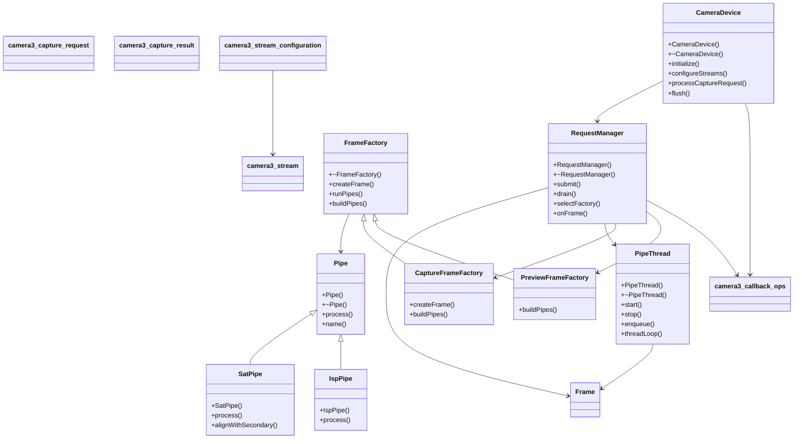

# 컴포넌트 구조와 책임

**수정할 클래스가 속한 패키지의 절로 이동해 책임과 상속 관계부터 확인하세요.**

| 지금 확인할 내용 | 이동할 절 |
|---|---|
| device 패키지의 클래스를 수정합니다. | [device](#device) |
| hal3 패키지의 클래스를 수정합니다. | [hal3](#hal3) |
| pipeline 패키지의 클래스를 수정합니다. | [pipeline](#pipeline) |

## 전체 구조도

## device

| 클래스 | 선언 위치 | 상속 | 책임 (주석) |
|---|---|---|---|
| `halcam::RequestManager` | `device/RequestManager.h:14` | – | Owns in-flight frames between processCaptureRequest and the result callback. Frames are created here, processed on PipeThread, and released in onFrameDone. |
| `halcam::CameraDevice` | `device/CameraDevice.h:10` | – | HAL3 device object. One instance per opened camera id. Framework calls arrive on the framework thread; results are sent from PipeThread. |

`halcam::CameraDevice` 는 하나의 카메라 ID 당 인스턴스를 가지며, 프레임워크 스레드에서 들어오는 요청을 처리하고 파이프 스레드에서 결과를 반환합니다 `device/CameraDevice.h:10`. 이 클래스는 초기화 시 프레임워크 콜백을 등록해야 하며, 스트림 설정 유효성 검사 후 요청 매니저를 재설정합니다 `device/CameraDevice.cpp:9`, `device/CameraDevice.cpp:27`. `processCaptureRequest` 는 프레임을 큐에 넣은 뒤 완료 대기 없이 즉시 반환하며, `flush` 는 큐에서 버린 프레임과 진행 중인 프레임을 모두 기다립니다 `device/CameraDevice.cpp:40`, `device/CameraDevice.cpp:47`.

`halcam::RequestManager` 는 프로세스 캡처 요청부터 결과 콜백까지의 진행 중인 프레임에 대한 소유권을 가집니다 `device/RequestManager.h:14`. 프레임은 여기서 생성되어 파이프 스레드에서 처리된 후, `onFrameDone` 에서 해제됩니다 `device/RequestManager.cpp:5`, `device/RequestManager.cpp:37`, `device/RequestManager.cpp:53`. `submit` 은 요청 팩토리를 선택하고 프레임을 작업자에게 넘기며, `drain` 은 모든 진행 중인 프레임이 반환될 때까지 블로킹합니다 `device/RequestManager.cpp:23`, `device/RequestManager.cpp:58`.

프레임 소유권은 `halcam::CameraDevice` 의 요청 처리 흐름과 `halcam::RequestManager` 의 작업자 사이에서 이동하며, 프레임 생성 및 해제 시점은 명확히 정의되어 있습니다. `processCaptureRequest` 가 완료 대기 없이 반환하는 동작은 프레임이 큐에 도착했을 때이며, 이는 결과 콜백 발생 전의 중간 상태를 의미합니다 `device/CameraDevice.cpp:40`.

다음 절인 "프레임 처리 흐름과 타이밍"을 확인하여 요청 제출 후 완료까지의 정확한 시간대와 스레드 소유권을 추가로 검증해야 합니다.

??? note "근거와 검토 정보: device"
    - 근거 파일: `device/CameraDevice.cpp`, `device/CameraDevice.h`, `device/RequestManager.cpp`, `device/RequestManager.h`
    - 근거 수준: 코드 확인 (정적 분석, simple_compdb 구성, commit `?`)
    - 인용 검증: 통과
    - 검토: 2026-09-17 · ollama/qwen3.5:4b · 사람 검토 전

## hal3

| 클래스 | 선언 위치 | 상속 | 책임 (주석) |
|---|---|---|---|
| `camera3_stream` | `hal3/types.h:5` | – | 확인 필요 |
| `camera3_stream_configuration` | `hal3/types.h:12` | – | 확인 필요 |
| `camera3_capture_request` | `hal3/types.h:18` | – | 확인 필요 |
| `camera3_capture_result` | `hal3/types.h:24` | – | 확인 필요 |
| `camera3_callback_ops` | `hal3/types.h:30` | – | Framework callback table. HAL calls process_capture_result on completion. |

`camera3_stream` 은 프레임워크가 호출하는 `process_capture_result` 를 처리하기 위해 `camera3_callback_ops` 를 통해 콜백을 관리합니다 `hal3/types.h:5`. `camera3_stream_configuration` 은 스트림의 초기 파라미터를 정의하며, 이는 캡처 요청 생성 시 참조됩니다 `hal3/types.h:12`. `camera3_capture_request` 는 실제 캡처 작업이 시작될 때 프레임워크에 의해 생성되며, 해당 클래스는 버퍼와 요청 정보를 포함합니다 `hal3/types.h:18`. `camera3_capture_result` 는 캡처가 완료된 후 결과 데이터를 전달하는 역할을 하며, 이는 `camera3_callback_ops` 의 프로세스를 통해 호출됩니다 `hal3/types.h:24`. 프레임워크는 `camera3_stream` 이 처리할 결과를 생성하고, 해당 클래스는 요청을 제출한 뒤 결과를 처리하여 콜백을 실행합니다. 버퍼와 요청의 소유권 및 해제 시점은 현재 문서에는 명시되어 있지 않아 확인이 필요합니다.

??? note "근거와 검토 정보: hal3"
    - 근거 파일: `hal3/types.h`
    - 근거 수준: 코드 확인 (정적 분석, simple_compdb 구성, commit `?`)
    - 인용 검증: 통과
    - 검토: 2026-09-17 · ollama/qwen3.5:4b · 사람 검토 전

## pipeline

| 클래스 | 선언 위치 | 상속 | 책임 (주석) |
|---|---|---|---|
| `halcam::Frame` | `pipeline/Frame.h:8` | – | One capture in flight. Created by a FrameFactory, consumed by pipes, released by RequestManager. |
| `halcam::Pipe` | `pipeline/Pipe.h:12` | – | One processing stage. Concrete pipes override process(). Ownership of the frame stays with the caller; a pipe never deletes a frame. |
| `halcam::IspPipe` | `pipeline/Pipe.h:25` | `halcam::Pipe` | Image signal processor stage. Always present. |
| `halcam::SatPipe` | `pipeline/Pipe.h:33` | `halcam::Pipe` | Spatial alignment transform stage for dual-camera fusion. Compiled only with -DUSE_SAT. |
| `halcam::FrameFactory` | `pipeline/FrameFactory.h:12` | – | Builds a Frame for a capture request and owns the pipe chain that will process it. Concrete factories decide which pipes are attached (preview vs. still capture). |
| `halcam::PreviewFrameFactory` | `pipeline/FrameFactory.h:28` | `halcam::FrameFactory` | Preview path: ISP only, low latency. |
| `halcam::CaptureFrameFactory` | `pipeline/FrameFactory.h:34` | `halcam::FrameFactory` | Still capture path: ISP followed by SAT when the build enables it. |
| `halcam::PipeThread` | `pipeline/PipeThread.h:14` | – | Worker thread that drains a frame queue. One PipeThread per RequestManager. enqueue() may be called from the framework thread; the handler runs on the worker thread. |

`halcam::FrameFactory` 는 캡처 요청을 받아 `halcam::Frame` 을 생성하고, 해당 프레임이 처리될 파이프 체인을 소유합니다 `pipeline/FrameFactory.h:12`. 구체적인 팩토리 클래스는 `buildPipes()` 를 통해 preview 경로에 ISP 만 추가하거나 still 캡처 경로는 SAT 를 포함하는지 결정합니다 `pipeline/FrameFactory.cpp:35`. 생성된 프레임은 `halcam::Pipe` 가 순차적으로 소비하며, 각 파이프는 호출자가 소유권을 유지하도록 프레임 삭제 없이 처리만 수행합니다 `pipeline/Pipe.h:12`.

`halcam::PipeThread` 는 하나의 `RequestManager` 당 하나씩 존재하며, 프레임 큐를 드레인하는 작업 스레드 역할을 합니다 `pipeline/PipeThread.h:14`. 이 스레드는 프레임이 제출되면 `enqueue()` 를 통해 처리 요청을 받지만, 실제 핸들러 실행은 worker 스레드 내에서 이루어집니다 `pipeline/PipeThread.cpp:27`. `start()` 는 한 번만 호출해도 안전하며, `stop()` 은 남은 프레임을 드레인하고 스레드를 종료합니다 `pipeline/PipeThread.cpp:10`.

버퍼와 파이프 체인의 소유권 흐름은 팩토리가 생성한 프레임이 파이프를 통해 처리될 때까지 호출자가 유지합니다 `pipeline/FrameFactory.h:12`. 파이프는 프레임의 소유권을 반환하지 않으며, 최종적으로 `RequestManager` 가 프레임을 해제합니다 `pipeline/Pipe.h:12`. 작업 스레드는 프레임 큐가 비어질 때까지 대기하며, 프레임 제출 시에는 즉시 처리를 시작하지 않고 큐에 쌓습니다 `pipeline/PipeThread.cpp:35`.

다음 절에서는 프레임 생성과 처리의 구체적인 타이밍 및 동기화 문제를 다룹니다.

??? note "근거와 검토 정보: pipeline"
    - 근거 파일: `pipeline/Frame.h`, `pipeline/FrameFactory.cpp`, `pipeline/FrameFactory.h`, `pipeline/Pipe.cpp`, `pipeline/Pipe.h`, `pipeline/PipeThread.cpp`, `pipeline/PipeThread.h`
    - 근거 수준: 코드 확인 (정적 분석, simple_compdb 구성, commit `?`)
    - 인용 검증: 통과
    - 검토: 2026-09-17 · ollama/qwen3.5:4b · 사람 검토 전

??? note "근거와 검토 정보"
    - 근거 파일: `device/CameraDevice.cpp`, `device/CameraDevice.h`, `device/RequestManager.cpp`, `device/RequestManager.h`, `hal3/types.h`, `pipeline/Frame.h`, `pipeline/FrameFactory.cpp`, `pipeline/FrameFactory.h`, `pipeline/Pipe.cpp`, `pipeline/Pipe.h`, `pipeline/PipeThread.cpp`, `pipeline/PipeThread.h`
    - 근거 수준: 코드 확인 (정적 분석, simple_compdb 구성, commit `?`)
    - 인용 검증: 통과
    - 검토: 2026-09-17 · ollama/qwen3.5:4b · 사람 검토 전

다음 단계: [핵심 시나리오 시퀀스](scenarios/index.md)
