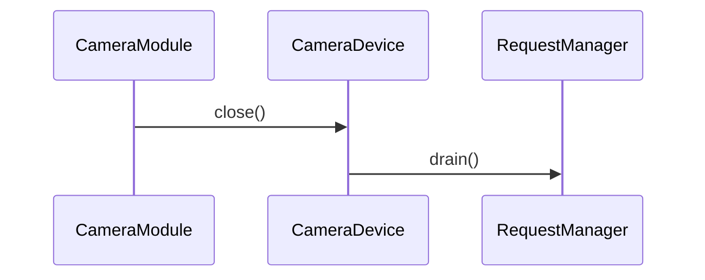

# 디바이스 종료 (camera_device_close)

**`camera_device_close(halcam::CameraDevice *)` 에서 시작하는 호출 순서를 아래 번호대로 따라가세요.**

## 호출 순서

1. `CameraModule` 가 `CameraDevice::close()` 를 호출합니다. `module/CameraModule.cpp:30`
2. `CameraDevice` 가 `RequestManager::drain()` 를 호출합니다. `device/CameraDevice.cpp:56`

## 이 흐름에서 확인할 것

`CameraModule` 은 `CameraDevice::close()` 를 호출하여 디바이스 종료 프로세스를 시작합니다 `module/CameraModule.cpp:30`. 이 호출은 요청 관리자가 모든 대기 중인 요청을 처리하도록 `RequestManager::drain()` 을 실행하게 합니다 `device/CameraDevice.cpp:56`. 정적 추적이 여기서부터 끊기는지, 아니면 더 깊은 내부 메커니즘까지 추적 가능한지는 현재 사실 목록에서 확인되지 않았습니다.

??? note "근거와 검토 정보"
    - 근거 파일: `device/CameraDevice.cpp`, `module/CameraModule.cpp`
    - 근거 수준: 코드 확인 (정적 분석, simple_compdb 구성, commit `?`)
    - 인용 검증: 통과
    - 검토: 2026-09-17 · ollama/qwen3.5:4b · 사람 검토 전

다음 단계: [스트림 구성 (configureStreams)](configure_streams.md)
