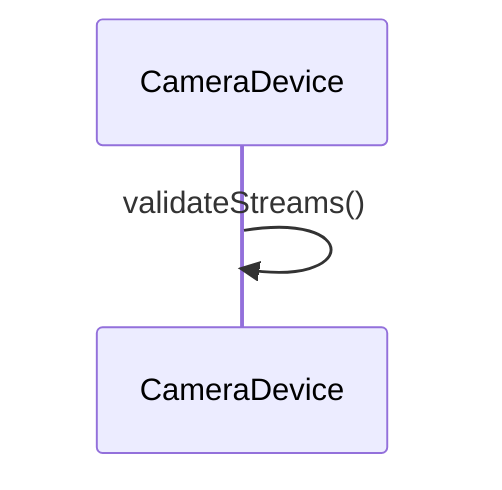

# 스트림 구성 (configureStreams)

**`halcam::CameraDevice::configureStreams(camera3_stream_configuration_t *)` 에서 시작하는 호출 순서를 아래 번호대로 따라가세요.**

## 호출 순서

1. `CameraDevice` 가 `CameraDevice::validateStreams()` 를 호출합니다. `device/CameraDevice.cpp:31`

## 이 흐름에서 확인할 것

`CameraDevice::configureStreams()` 는 요청이 들어온 직후 `validateStreams()` 를 호출하여 스트림 구성을 검증합니다 `device/CameraDevice.cpp:31`. 이 단계에서 유효하지 않은 파라미터가 발견되면 함수는 즉시 종료하며 이후 컴포넌트를 거치지 않습니다. 검증이 통과된 경우에만 다음 단계로 진행되어 실제 하드웨어 설정이 시작됩니다.

??? note "근거와 검토 정보"
    - 근거 파일: `device/CameraDevice.cpp`
    - 근거 수준: 코드 확인 (정적 분석, simple_compdb 구성, commit `?`)
    - 인용 검증: 통과
    - 검토: 2026-09-17 · ollama/qwen3.5:4b · 사람 검토 전

다음 단계: [플러시 (flush)](flush.md)
