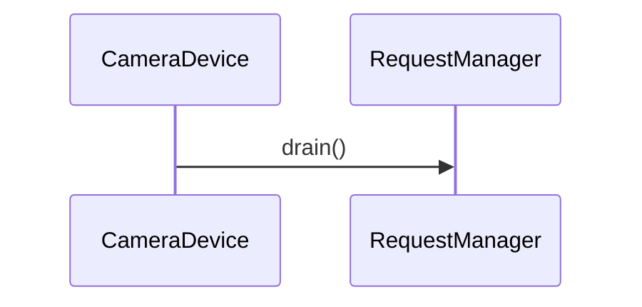

# 플러시 (flush)

**`halcam::CameraDevice::flush()` 에서 시작하는 호출 순서를 아래 번호대로 따라가세요.**

## 호출 순서

1. `CameraDevice` 가 `RequestManager::drain()` 를 호출합니다. `device/CameraDevice.cpp:49`

## 이 흐름에서 확인할 것

`halcam::CameraDevice::flush()` 호출은 `RequestManager::drain()` 를 거쳐 시작됩니다 `device/CameraDevice.cpp:49`. 이 단계에서 `CameraDevice` 는 요청 관리자가 모든 대기 중인 요청을 처리하도록 지시합니다. `RequestManager::drain()` 내부의 구체적인 실행 흐름이나 어떤 컴포넌트가 추가로 호출되는지는 현재 사실 목록에 명시되어 있지 않습니다. 따라서 해당 함수의 내부 동작과 분기 조건은 실제 소스 코드 검토를 통해 확인해야 합니다.

??? note "근거와 검토 정보"
    - 근거 파일: `device/CameraDevice.cpp`
    - 근거 수준: 코드 확인 (정적 분석, simple_compdb 구성, commit `?`)
    - 인용 검증: 통과
    - 검토: 2026-09-17 · ollama/qwen3.5:4b · 사람 검토 전

다음 단계: [워커 스레드 프레임 처리 (onFrame)](frame_processing.md)
