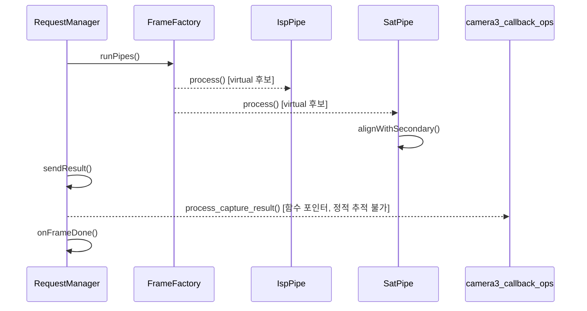

# 워커 스레드 프레임 처리 (onFrame)

**`halcam::RequestManager::onFrame(halcam::Frame &)` 에서 시작하는 호출 순서를 아래 번호대로 따라가세요.**

## 호출 순서

1. `RequestManager` 가 `FrameFactory::runPipes()` 를 호출합니다. `device/RequestManager.cpp:40`
2. `FrameFactory` 가 `IspPipe::process()` 를 호출합니다. (virtual 후보) `pipeline/FrameFactory.cpp:17`
3. `FrameFactory` 가 `SatPipe::process()` 를 호출합니다. (virtual 후보) `pipeline/FrameFactory.cpp:17`
4. `SatPipe` 가 `SatPipe::alignWithSecondary()` 를 호출합니다. `pipeline/Pipe.cpp:17`
5. `RequestManager` 가 `RequestManager::sendResult()` 를 호출합니다. `device/RequestManager.cpp:42`
6. `RequestManager` 가 `camera3_callback_ops::process_capture_result()` 를 호출합니다. (함수 포인터, 정적 추적 불가) `device/RequestManager.cpp:50`
7. `RequestManager` 가 `RequestManager::onFrameDone()` 를 호출합니다. `device/RequestManager.cpp:44`

## 이 흐름에서 확인할 것

프레임 처리 요청이 들어온 후 결과 콜백까지의 호출 경로는 `RequestManager` 를 중심으로 파이프라인과 외부 작업자가 교차하며 진행됩니다. 요청은 먼저 `RequestManager::onFrame()` 에서 시작하여 `FrameFactory` 를 거쳐 파이프라인 처리가 완료되면 다시 `RequestManager` 로 돌아옵니다. 이 과정에서 특정 함수는 가상 함수로 구현되어 있어 정적 분석이 불가능하며, 결과 처리는 외부 포인터를 통해 전달됩니다.

`RequestManager::onFrame()` 은 프레임 데이터를 받자마자 `FrameFactory::runPipes()` 를 호출하여 처리 시작합니다 `device/RequestManager.cpp:40`. `FrameFactory` 는 이 단계에서 가상 함수인 `IspPipe::process()` 와 `SatPipe::process()` 를 호출하여 구체적인 파이프라인을 실행하도록 지시합니다 `pipeline/FrameFactory.cpp:17`.

`SatPipe` 가 처리를 수행할 때 `SatPipe::alignWithSecondary()` 를 호출하여 보조 데이터와 정렬 작업을 진행합니다 `pipeline/Pipe.cpp:17`. 파이프라인 작업이 완료되면 `RequestManager` 는 다시 `sendResult()` 를 호출하여 결과를 전달하고, 이어지는 `camera3_callback_ops::process_capture_result()` 함수는 외부 포인터를 통해 처리됩니다 `device/RequestManager.cpp:42`, `device/RequestManager.cpp:50`.

결과 처리가 끝난 후 `RequestManager` 는 최종적으로 `onFrameDone()` 을 호출하여 전체 작업이 종료됨을 알립니다 `device/RequestManager.cpp:44`. `camera3_callback_ops::process_capture_result()` 함수는 정적 추적 대상이 아니므로 실제 실행 흐름은 런타임에 결정됩니다.

다음으로 프레임 처리 완료 후의 상태 관리나 메모리 반환 절차를 확인합니다.

확인 필요: 가상 함수나 함수 포인터 때문에 정적으로 끊긴 호출이 1 개 있습니다. 끊긴 지점 이후는 코드를 직접 따라가야 합니다.

??? note "근거와 검토 정보"
    - 근거 파일: `device/RequestManager.cpp`, `pipeline/FrameFactory.cpp`, `pipeline/Pipe.cpp`
    - 근거 수준: 코드 확인 (정적 분석, simple_compdb 구성, commit `?`)
    - 인용 검증: 통과
    - 검토: 2026-09-17 · ollama/qwen3.5:4b · 사람 검토 전

다음 단계: [디바이스 오픈 (camera_device_open)](open_device.md)
