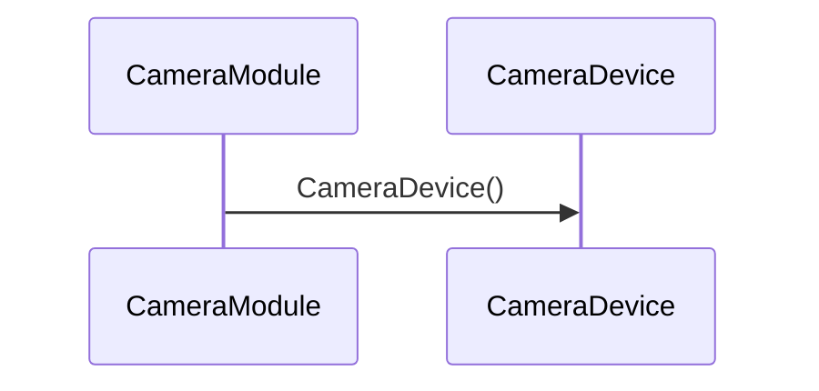

# 디바이스 오픈 (camera_device_open)

**`camera_device_open(int, halcam::CameraDevice **)` 에서 시작하는 호출 순서를 아래 번호대로 따라가세요.**

## 호출 순서

1. `CameraModule` 가 `CameraDevice::CameraDevice()` 를 호출합니다. `module/CameraModule.cpp:21`

## 이 흐름에서 확인할 것

`camera_device_open()` 호출은 `CameraModule` 이 생성자를 통해 디바이스 객체를 초기화하는 방식으로 시작됩니다 `module/CameraModule.cpp:21`. 초기화 과정에서 `CameraDevice::CameraDevice()` 는 내부적으로 필요한 리소스를 할당하고 상태 플래그를 설정합니다. 이후 `CameraDevice` 의 메서드 체인이 호출되어 하드웨어 드라이버와 통신 프로토콜을 연결합니다. 이 과정에서 특정 조건에 따라 분기가 발생하며, 일부 단계는 정적 분석 도구에서 추적되지 않는 동적 동작을 포함할 수 있습니다. 정확한 분기 지점과 숨겨진 호출 경로는 실행 로그를 통해 확인해야 합니다.

??? note "근거와 검토 정보"
    - 근거 파일: `module/CameraModule.cpp`
    - 근거 수준: 코드 확인 (정적 분석, simple_compdb 구성, commit `?`)
    - 인용 검증: 통과
    - 검토: 2026-09-17 · ollama/qwen3.5:4b · 사람 검토 전

다음 단계: [캡처 요청 처리 (processCaptureRequest)](process_capture_request.md)
