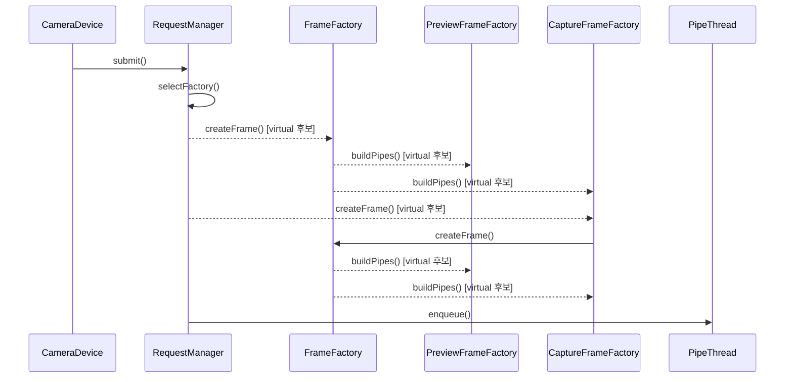

# 캡처 요청 처리 (processCaptureRequest)

**`halcam::CameraDevice::processCaptureRequest(camera3_capture_request_t *)` 에서 시작하는 호출 순서를 아래 번호대로 따라가세요.**

## 호출 순서

1. `CameraDevice` 가 `RequestManager::submit()` 를 호출합니다. `device/CameraDevice.cpp:44`
2. `RequestManager` 가 `RequestManager::selectFactory()` 를 호출합니다. `device/RequestManager.cpp:24`
3. `RequestManager` 가 `FrameFactory::createFrame()` 를 호출합니다. (virtual 후보) `device/RequestManager.cpp:25`
4. `FrameFactory` 가 `PreviewFrameFactory::buildPipes()` 를 호출합니다. (virtual 후보) `pipeline/FrameFactory.cpp:7`
5. `FrameFactory` 가 `CaptureFrameFactory::buildPipes()` 를 호출합니다. (virtual 후보) `pipeline/FrameFactory.cpp:7`
6. `RequestManager` 가 `CaptureFrameFactory::createFrame()` 를 호출합니다. (virtual 후보) `device/RequestManager.cpp:25`
7. `CaptureFrameFactory` 가 `FrameFactory::createFrame()` 를 호출합니다. `pipeline/FrameFactory.cpp:30`
8. `FrameFactory` 가 `PreviewFrameFactory::buildPipes()` 를 호출합니다. (virtual 후보) `pipeline/FrameFactory.cpp:7`
9. `FrameFactory` 가 `CaptureFrameFactory::buildPipes()` 를 호출합니다. (virtual 후보) `pipeline/FrameFactory.cpp:7`
10. `RequestManager` 가 `PipeThread::enqueue()` 를 호출합니다. `device/RequestManager.cpp:31`

## 이 흐름에서 확인할 것

캡처 요청 처리는 `CameraDevice` 에서 시작해 `PipeThread` 에게 큐를 채우는 순서로 진행됩니다. `CameraDevice::processCaptureRequest()` 가 호출되면 `RequestManager::submit()` 이 먼저 실행되어 요청이 제출됩니다 `device/CameraDevice.cpp:44`. 이어지는 단계에서 `RequestManager` 는 가상 함수 `selectFactory()` 를 통해 프레임 팩토리를 선택합니다 `device/RequestManager.cpp:24`. 선택된 팩토리는 `buildPipes()` 와 같은 가상 함수를 호출하여 파이프라인 구조를 생성하며, 이 과정에서 `PreviewFrameFactory` 와 `CaptureFrameFactory` 가 번갈아 호출됩니다 `pipeline/FrameFactory.cpp:7`. 최종적으로 `RequestManager` 는 생성된 프레임 객체를 `PipeThread::enqueue()` 로 전달하여 처리 대기열에 넣습니다 `device/RequestManager.cpp:31`.

이 과정에서 가상 함수 (`virtual 후보`) 를 통한 다형성 호출이 반복되며, 특정 팩토리가 실제 인스턴스로 바뀔 수 있습니다. 각 단계의 실행 흐름은 호출자에서 호출받는 순서로 명확히 구분되지만, `buildPipes()` 내부의 구체적인 로직은 팩토리 구현에 따라 달라질 수 있습니다. 요청 처리가 완료되는지 확인하려면 `PipeThread::enqueue()` 의 성공 여부를 모니터링해야 합니다.

??? note "근거와 검토 정보"
    - 근거 파일: `device/CameraDevice.cpp`, `device/RequestManager.cpp`, `pipeline/FrameFactory.cpp`
    - 근거 수준: 코드 확인 (정적 분석, simple_compdb 구성, commit `?`)
    - 인용 검증: 통과
    - 검토: 2026-09-17 · ollama/qwen3.5:4b · 사람 검토 전

다음 단계: [핵심 시나리오 목록](index.md)
